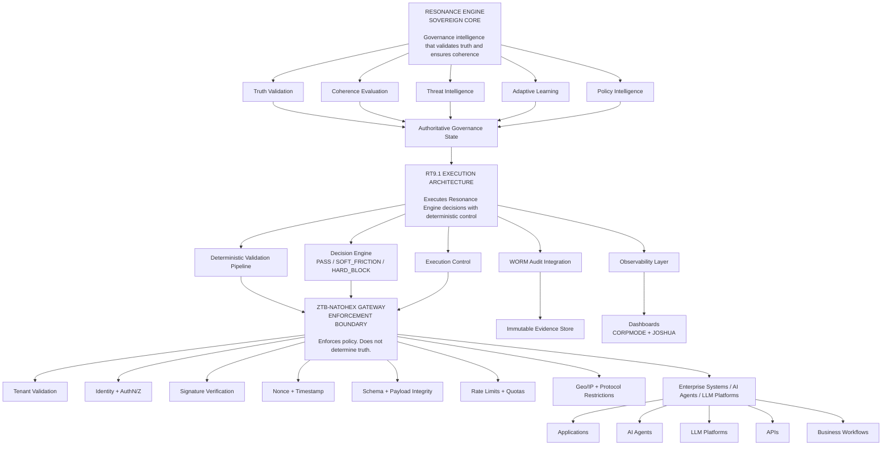
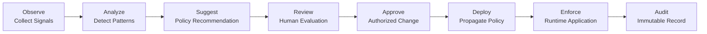

# Resonance Engine + RT9.1 — Enterprise Blueprint v2.0

Status: LOCKED
Version: 2.0
Architecture: Governance-First
Effective Date: 2026-04-26

## Core Principle

```text
Governance First. Always.

The Resonance Engine defines truth.
RT9.1 executes governance decisions.
The ZTB-NATOHEX Gateway enforces those decisions at the boundary.
```

## Visual Hierarchy



## Governance-First Layering

| Order | Layer | Role | Authority |
|---:|---|---|---|
| 1 | Resonance Engine | Sovereign Core | Defines truth, coherence, threat, and policy |
| 2 | RT9.1 | Execution Architecture | Executes decisions deterministically |
| 3 | ZTB-NATOHEX Gateway | Enforcement Boundary | Enforces policy at the edge |
| 4 | Enterprise Systems | Governed Targets | Operate under governed guardrails |
| 5 | WORM / Observability | Evidence Layer | Proves what happened |

## Policy Lifecycle



## Decision Outcomes

| Outcome | Meaning | System Response |
|---|---|---|
| PASS | Request is allowed | Continue execution |
| SOFT_FRICTION | Additional verification or human review required | Review / adapt |
| HARD_BLOCK | Request is denied and logged | Prevent / protect |

## Cross-Cutting Enterprise Services

- Identity and Access: Microsoft Entra ID, RBAC, least privilege
- Key Management: Azure Key Vault, customer-managed keys
- Network Security: VNet, private endpoints, NSGs, DDoS protection
- Monitoring and SIEM: Azure Monitor / Sentinel, real-time alerts
- Automation and IaC: Terraform / Bicep, CI/CD pipeline
- Compliance: SOC 2, ISO 27001, GDPR, evidence reporting
- Backup and DR: multi-region backups, RTO/RPO readiness

## Architectural Lock

```text
INTELLIGENCE DEFINES POLICY.
EXECUTION ENFORCES POLICY.

The Resonance Engine is the sovereign core.
RT9.1 is the execution system.
The Gateway is the enforcement boundary.
```
